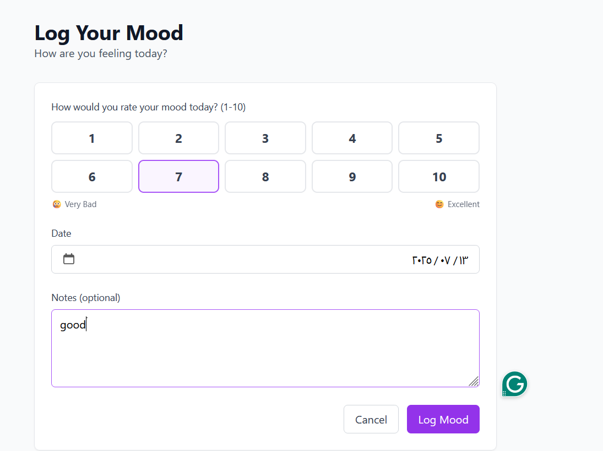

# Mood-Tracker

 

  

A simple Laravel project to track your daily mood using forms, database, and Blade views.

## 🚀 Features

- Add mood with description
- Filter moods by date
- Color-coded mood types (Happy, Sad, Neutral)

## 📸 Screenshot

## 🛠️ Built With

- Laravel 11
- Blade
- SQLite/MySQL

## 📚 Learning Goals

This project helped me practice:
- Route → Controller → Model → View
- Validation
- Blade forms
- CRUD logic
